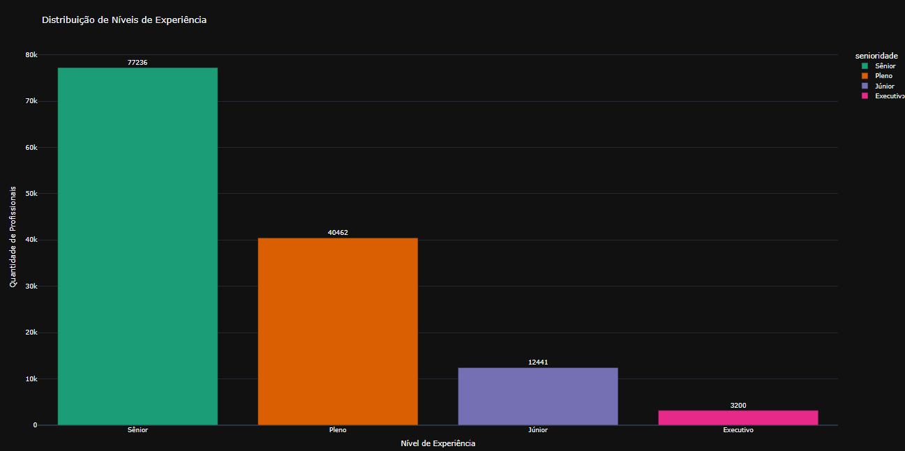
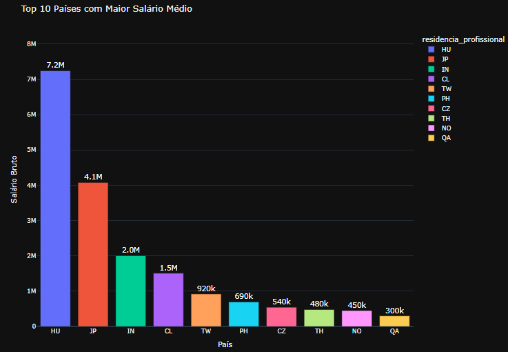
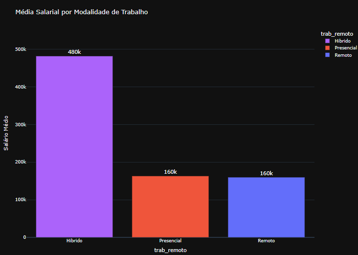
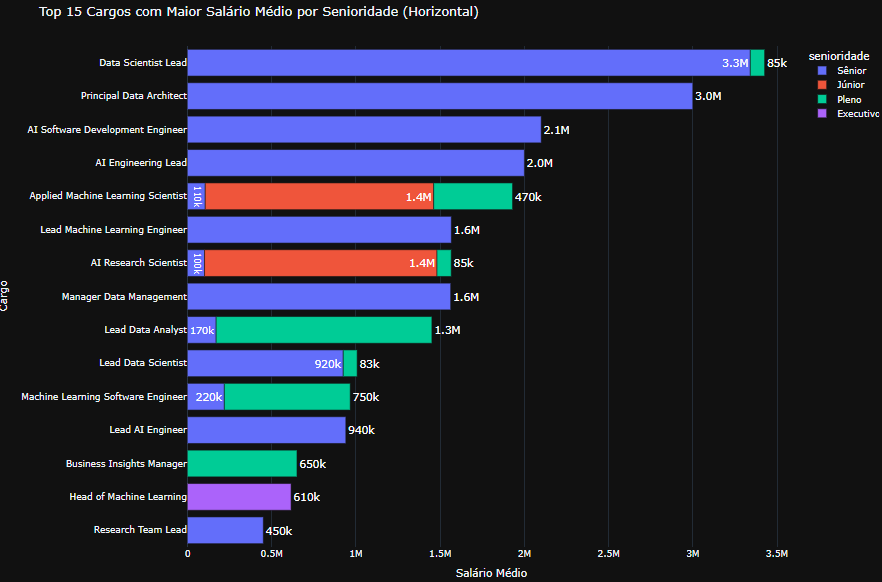
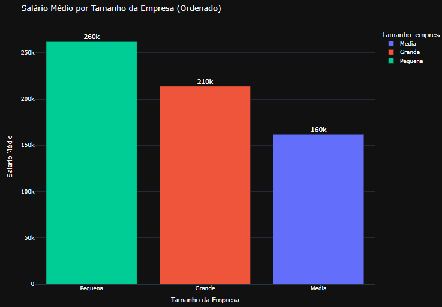
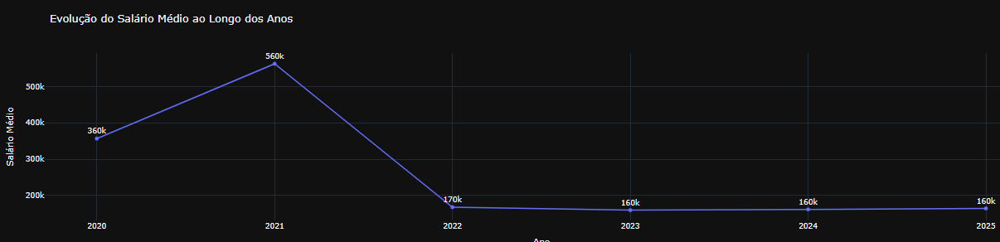
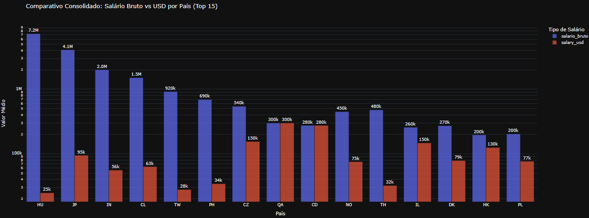
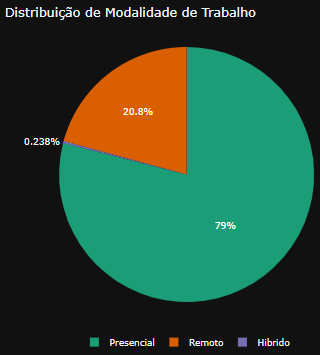
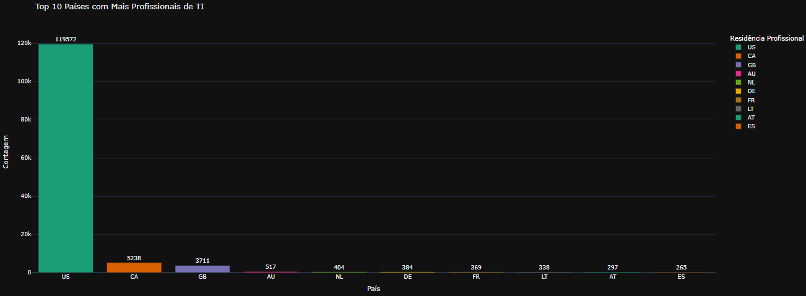
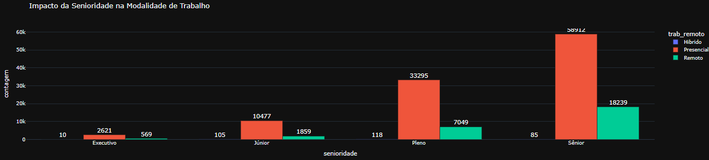

# 📊 Análise Salarial TI

Este projeto é uma **evolução do ETL_SALARIOS_TI**.  
Aqui utilizamos os dados já tratados no ETL para realizar **análises exploratórias e visualizações interativas** em ambiente **Databricks**, com **Pandas** e **Plotly**.

---

## 🚀 Objetivo
- Explorar os dados salariais de profissionais de TI.
- Gerar gráficos comparativos por país, senioridade, modalidade de trabalho e tamanho de empresa.
- Obter insights sobre distribuição salarial.

---

## 🛠️ Tecnologias utilizadas
- **Databricks** (execução do notebook)
- **Python 3**
- **Pandas** (manipulação de dados)
- **Plotly Express** (visualizações interativas)

---

## 📊 Principais análises
## 1. Qual o nível de experiência mais comum na base? 
 
## 2. Top 10 países com maior média salarial.  

## 3. Existe relação entre trabalho remoto e salário? 
 
## 4. Qual o cargo mais bem pago por senioridade?  

## 5. Como varia o salário médio por tamanho da empresa? 
 
## 6. Qual o crescimento salarial ao longo dos anos?

## 7. Há diferença entre salário bruto e salary_usd por região?

## 8. Qual o percentual de profissionais remotos vs presenciais?

## 9. Quais países concentram mais profissionais de TI?

## 10. Qual o impacto da senioridade no trabalho remoto?

# Fim
